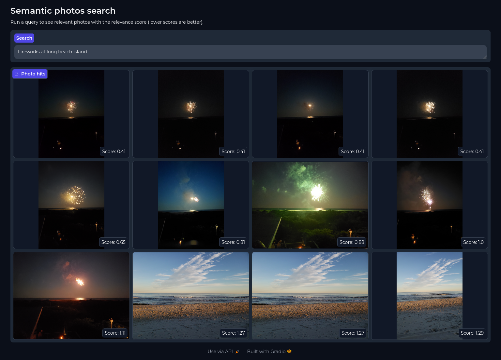

# Semantic photos

Make you photo albums semantically search-able. Using scene captioning combined with tagged people and locations make your albums work better for you and recall memories faster and naturally.

Photo searching is typically restricted to tag filtering and keyword searching if images have description notes manually added. This app aims to make photo libraries easier and more natural to search through by creating a search index based on
* image-to-text auto-captioning
* reverse geo coding to add place name descriptions
* descriptions of named people in the image

This app leverages your existing photo libraries and creates a light weight database to run searches without the need to copy, move or modify your original images. This currently supports JPEG, PNG, and HEIC image types.

## Getting started

Clone the repository
```bash
git clone https://github.com/brainsqueeze/semantic-photos.git
```

Optionally set a path to cache the transformer models, image-to-text models, and ChromaDB files
```bash
export MODEL_CACHE_DIR=/cache_dir/<some_path>
```

This project uses the [Geonames API](https://www.geonames.org/export/web-services.html) to do reverse geocoding on lat/lon coordinates. You will need to create an account and use your username to authenticate with the service. Usernames can be set with
```bash
export GEONAMES_USERNAME=<your_username>
```

## Building a search database on your own photos

```python
import os

from tqdm import tqdm

from semantic_photos.galleries.database import DigikamReader
from semantic_photos.geographies import GeonamesReverseGeocoder
from semantic_photos.models.caption import ImageCaption
from semantic_photos.models.documents import ImageVectorStore
from semantic_photos.models.schema import ImageData
from semantic_photos.utils import describe_people_in_scene, describe_geo_location

captioner = ImageCaption(device="cpu")  # if CUDA is available then set `device="cuda"`
rev_geo_coder = GeonamesReverseGeocoder(geonames_user=os.getenv("GEONAMES_USERNAME"))
docs = ImageVectorStore(os.environ["MODEL_CACHE_DIR"])

album_names = [...]

metadata = []
with DigikamReader(path="/absolute/path/to/photo/library") as db:
    albums = db.albums
    for album in album_names:

        for record in tqdm(
            db.stream_media_from_album(album_id=albums[album]["album_id"]),
            total=albums[album]["count"],
            desc=f"Loading {album}"
        ):
            meta = albums[record.relative_path]
            img_data = ImageData(
                path=os.path.join(meta["path"], record.image_file_name),
                album_name=meta["name"],
                file_name=record.image_file_name,
                created=record.creation_date,
                caption=captioner.caption(os.path.join(meta["path"], record.image_file_name))[0]["generated_text"],
            )

            if record.people_names:
                img_data.people_description = describe_people_in_scene(record.people_names.split(','))
            if record.lat and record.lon:
                geos = rev_geo_coder.find_nearby_place_name(
                    latitude=record.lat,
                    longitude=record.lon
                )
                img_data.geo_description = describe_geo_location(geos.get("geonames", []))

            metadata.append(img_data)

            if len(metadata) > 256:
                docs.add_images(metadata)
                metadata.clear()
        
        if len(metadata) > 0:
            docs.add_images(metadata)
            metadata.clear()

rev_geo_coder.teardown()
```
This will create a ChromaDB database within the directory set by `MODEL_CACHE_DIR`. The database can be queried like
```python
docs.query("Three people wearing sunglasses swimming in a pool near Pacific Beach")
```

## Searching

<center></center>

To start the search app simply run
```bash
python -m semantic_photos.app
```
This will start a Gradio app server at `http://localhost:7860`. This looks for a ChromaDB database located at `MODEL_CACHE_DIR`. You can override this location if your Chroma file is located elsewhere by running
```bash
python -m semantic_photos.app --chroma_path=<absolute_path>
```

## Limitations

Currently this only works with [Digikam](https://www.digikam.org/) photo libraries. If you would like to enable support for other libraries please make a pull request.

This has only been tested on Linux operating systems, cross-platform support is on the road map.